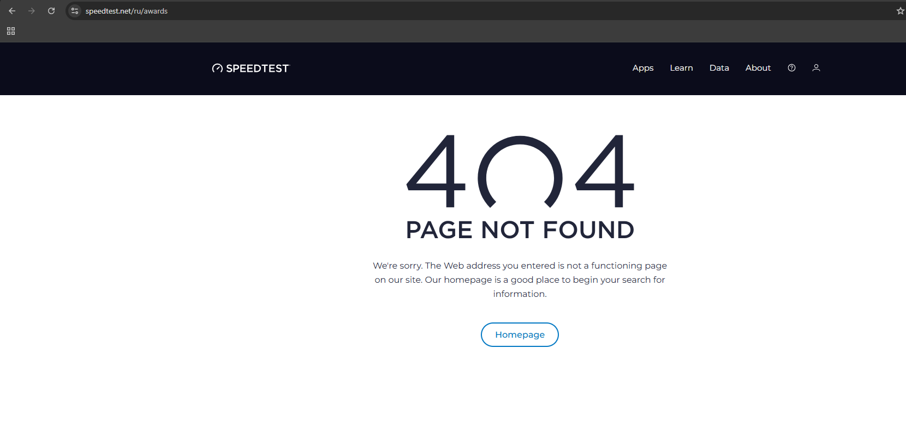

# Bug #005
### Summary
Страницы с наградами, которая указана в header и footer, не существует, если локализация сайта на русском языке

### Priority
Medium

### Environment
- OS: Windows 11 23H2
- Browser: Google Chrome 137.0.7151.56

### Steps to Reproduce

1. Открыть главную страницу веб-сайта speedtest.net
2. Перевести язык сайта на русский
3. Навести курсор на Data в Header-отделе сайта
4. Нажать на "Награды сервиса Speedtest"

### Expected Result
Веб-сайт перенаправляет пользователя на существующую веб-страницу с наградами сервиса

### Actual Result
Веб-сайт перенаправляет пользователя на некорректный URL-адрес: `www.speedtest.net/ru/awards`.

Сервер возвращает ошибку `404 Not Found`

### Attachments

### Reported by
Iliyas Bushanov