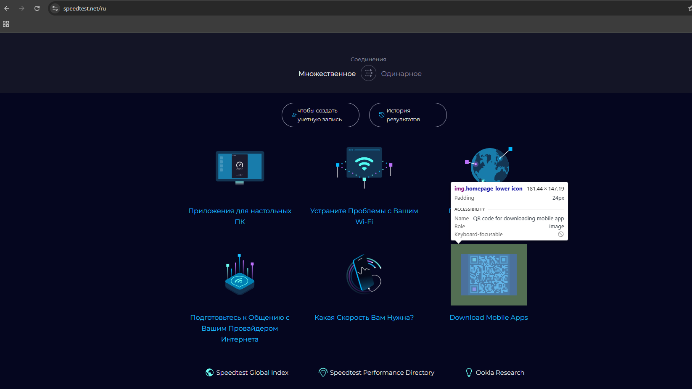

# Bug #006
### Summary
Изображение с QR - кодом на мобильное приложение проекта в блоке с дополнительной информацией не кликабельно

### Priority
Medium

### Environment
- OS: Windows 11 23H2
- Browser: Google Chrome 137.0.7151.56

### Steps to Reproduce

1. Открыть главную страницу веб-сайта speedtest.net
2. Проскроллить до дополнительного информационного блока (расположен выше футера)
3. Нажать на иконку QR-кода над гиперссылкой "Download Mobile App"


### Expected Result
Иконка кликабельна так же, как и надпись "Download Mobile App" и веб-сайт перенаправляет пользователя на веб-страницу с возможностью загрузки приложения на платформу Android и iOS: 
```
www.speedtest.net/apps/mobile
```

### Actual Result
Иконка не кликабельна, веб-сайт никак не реагирует при наведении курсора или нажатии на изображение. У элемента изображения 
```html

``` 
отсутствует обертка 
```html
<a href="...">
```

### Attachments


### Reported by
Iliyas Bushanov